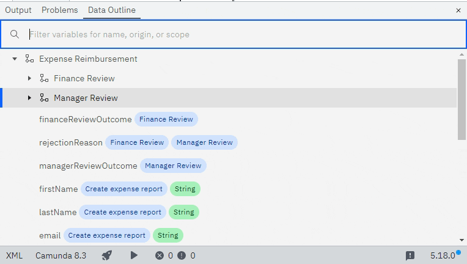

# Camunda Modeler Data Outline Plugin

[](https://github.com/camunda/camunda-modeler)

This plugin adds a new Tab to the bottom panel for Camunda 8 diagrams. It displays a tree view of the process scopes. You can search for specific data in your process using the search bar.



## How to install

1. Download the [ZIP file from the `latest` branch](http://github.com/marstamm/camunda-modeler-data-outline-plugin/zipball/latest/).
2. Unpack the archive into the `plugins` directory of the Camunda Modeler (cf. [Camunda Documentation](https://docs.camunda.io/docs/next/components/modeler/desktop-modeler/plugins/#plugging-into-camunda-modeler)).
3. Restart the Camunda Modeler and open a Camunda 8 Diagram.

## Development

To get the development setup make sure to have [NodeJS](https://nodejs.org/en/download/) installed.
As soon as you are set up, clone the project and execute

```
npm install
npm start
```

## License

MIT
